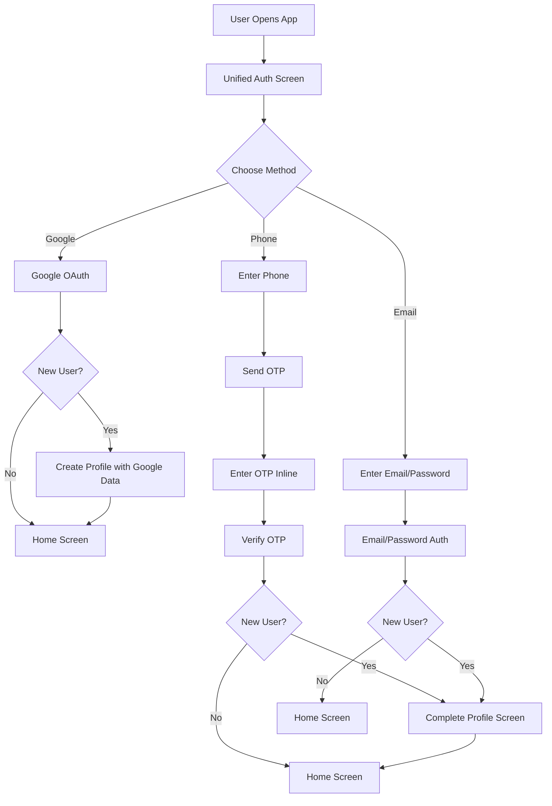

#Unified Single-Factor Authentication Flow

## Overview

Remove the 2-factor authentication flow and replace it with a unified single-screen authentication that supports three methods:

- **Google OAuth** (provides name, email, profile image automatically)
- **Phone Number** (OTP verification via SMS)
- **Email/Password** (traditional email and password)

The same screen handles both login and registration seamlessly. New users (phone/email) will be prompted to complete their profile (name, photo, sports preferences) after first authentication.

## Current State Analysis

### Existing Files to Modify

- [`apps/player-app/app/(auth)/sign-in.tsx`](apps/player-app/app/\\(auth)/sign-in.tsx) - Currently phone/password + Google
- [`apps/player-app/app/(auth)/sign-up.tsx`](apps/player-app/app/\\(auth)/sign-up.tsx) - Currently phone OTP flow with email/password option
- [`apps/player-app/app/(onboarding)/otp-verification.tsx`](apps/player-app/app/\\(onboarding)/otp-verification.tsx) - OTP verification screen (will be integrated)
- [`apps/player-app/lib/auth.ts`](apps/player-app/lib/auth.ts) - Auth utility functions

### Files to Remove/Deprecate

- The separate sign-in and sign-up screens will be replaced by a unified screen
- OTP verification will be integrated into the main flow (not a separate screen)

### Files to Create

- [`apps/player-app/app/(auth)/auth.tsx`](apps/player-app/app/\\(auth)/auth.tsx) - New unified authentication screen
- [`apps/player-app/app/(onboarding)/complete-profile.tsx`](apps/player-app/app/\\(onboarding)/complete-profile.tsx) - Profile completion screen for phone/email users

## Implementation Plan

### 1. Create Unified Authentication Screen

**File:** [`apps/player-app/app/(auth)/auth.tsx`](apps/player-app/app/\\(auth)/auth.tsx)A single screen that:

- Shows three authentication method options (Google, Phone, Email)
- Adapts the form based on selected method
- Handles both login and registration automatically
- For phone: Shows phone input → sends OTP → shows OTP input inline
- For email: Shows email/password fields
- For Google: Direct OAuth flow

**Key Features:**

- Method selector (three buttons or tabs)
- Dynamic form that changes based on selected method
- Inline OTP verification for phone (no separate screen)
- Automatic detection of new vs. returning users
- Seamless transition to profile completion for new users

### 2. Update Authentication Logic

**File:** [`apps/player-app/lib/auth.ts`](apps/player-app/lib/auth.ts)Add/update functions:

- `authenticateWithGoogle()` - Handle Google OAuth (web + mobile)
- `authenticateWithPhone()` - Send OTP and verify in one flow
- `authenticateWithEmail()` - Email/password authentication
- `checkUserExists()` - Check if user is new or returning
- `createUserProfile()` - Create Firestore profile with available data

### 3. Create Profile Completion Screen

**File:** [`apps/player-app/app/(onboarding)/complete-profile.tsx`](apps/player-app/app/\\(onboarding)/complete-profile.tsx)Screen for phone/email users to complete their profile:

- Name input
- Profile photo upload/selection
- Preferred sports selection
- Any other basic info from existing `basic-info.tsx`

### 4. Update Navigation Flow

**File:** [`apps/player-app/app/index.tsx`](apps/player-app/app/index.tsx)Update root redirect to use new unified auth screen:

- Change redirect from `/(auth)/sign-in` to `/(auth)/auth`

**File:** [`apps/player-app/app/(auth)/_layout.tsx`](apps/player-app/app/\\(auth)/_layout.tsx)Ensure layout supports the new auth screen.

### 5. Handle User Flow Logic

**After Authentication:**

1. **Google Users:**

- Check if Firestore profile exists
- If new: Create profile with Google data (name, email, photo)
- Navigate to home (all info available)

2. **Phone/Email Users:**

- Check if Firestore profile exists
- If new: Navigate to `complete-profile` screen
- If returning: Navigate to home

### 6. Remove/Deprecate Old Screens

- Keep `sign-in.tsx` and `sign-up.tsx` temporarily for backward compatibility (redirect to new screen)
- Or remove them entirely and update all references
- Remove or repurpose `otp-verification.tsx` (OTP will be inline in auth screen)

### 7. Update Forgot Password Flow

**File:** [`apps/player-app/app/(auth)/forgot-password.tsx`](apps/player-app/app/\\(auth)/forgot-password.tsx)Update to work with the new unified flow:

- Support both phone and email password reset
- Update navigation to return to unified auth screen

## Data Flow

## Technical Details

### Phone OTP Flow (Inline)

- User enters phone number
- Click "Send Code" → OTP sent via SMS
- Form expands to show OTP input fields (4-6 digits)
- User enters OTP → verified inline
- No separate screen navigation

### Email/Password Flow

- User enters email and password
- On submit: Check if user exists
- If new: Create account → navigate to profile completion
- If existing: Sign in → navigate to home

### Google OAuth Flow

- Click "Sign in with Google"
- OAuth popup/redirect
- On success: Extract profile data (name, email, photo)
- Create/update Firestore profile
- Navigate to home

## Profile Data Structure

**Google Users (auto-populated):**

- `displayName` - from Google
- `email` - from Google
- `photoURL` - from Google
- `phoneNumber` - null (unless added later)

**Phone/Email Users (collected on first login):**

- `displayName` - from complete-profile screen
- `email` - from email auth or null for phone users
- `phoneNumber` - from phone auth
- `photoURL` - from complete-profile screen
- `preferredSports` - from complete-profile screen

## Migration Considerations

- Existing users with phone/password auth will continue to work
- Existing users with phone OTP auth will need to use new flow